# 🔄 System Workflow

A visual walkthrough of the entire enrollment process — from setup to results.

---

### 1. Admin sets up submission window

Configure when teachers can submit subjects.

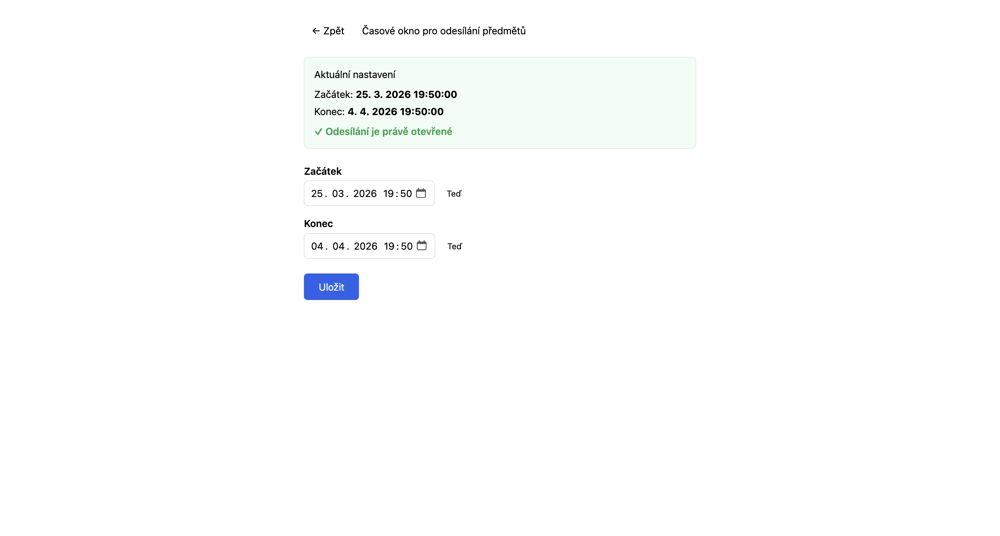

---

### 2. Admin sets up voting windows

Configure when each grade can vote.

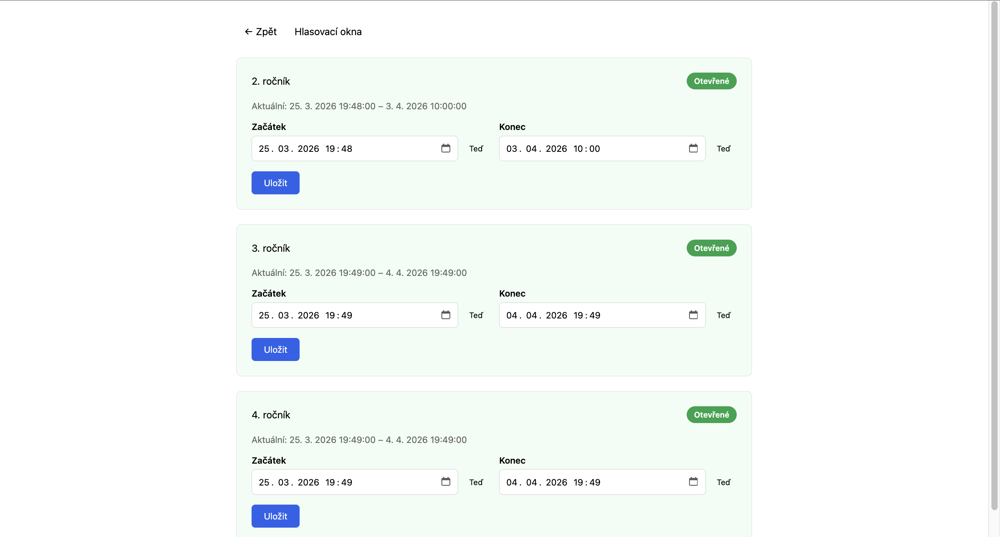

---

### 3. Teachers submit subjects

Teachers see their dashboard and submit elective subjects for approval.

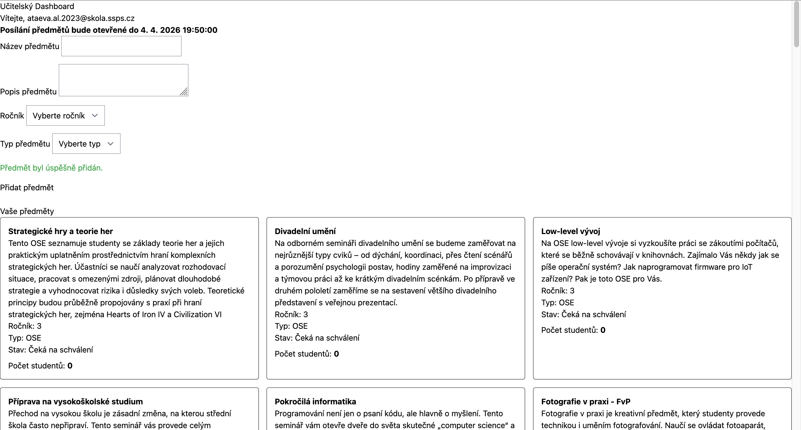

---

### 4. Admin reviews & approves subjects

Filter by state, accept or reject with one click.

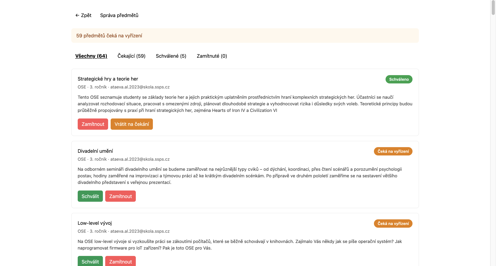

---

### 5. Students see available subjects

Each student sees their dashboard with subject cards and voting buttons.

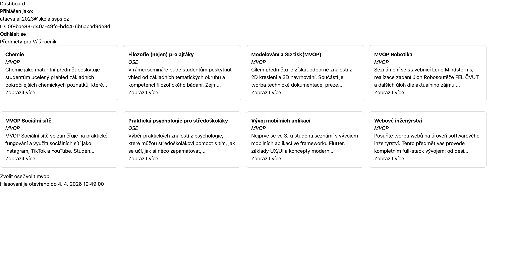

---

### 6. Students rank preferences

Drag-and-drop interface to order subjects from most to least preferred.

---

### 7. Admin runs sorting algorithm

Subjects are ranked by weighted votes and distributed across columns using a snake draft.

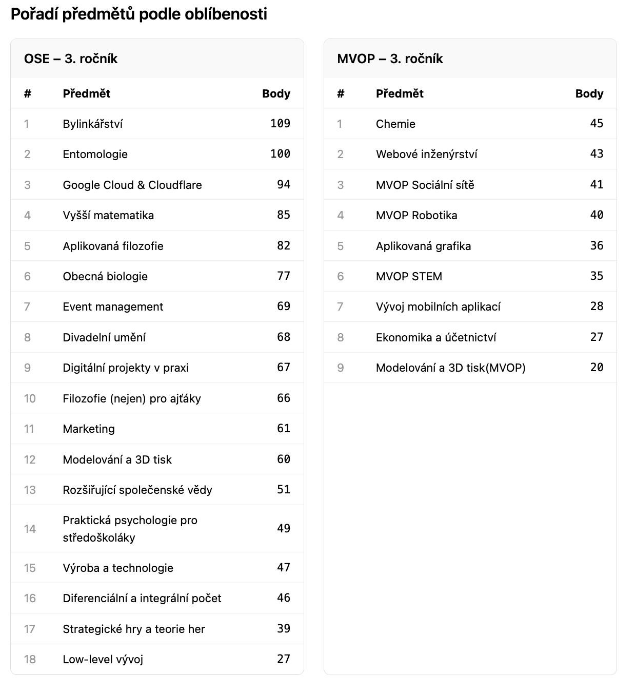

---

### 8. Subjects are distributed into columns (required by the school schedule)

Admin can drag-and-drop subjects between columns while maintaining fair preferential balance.

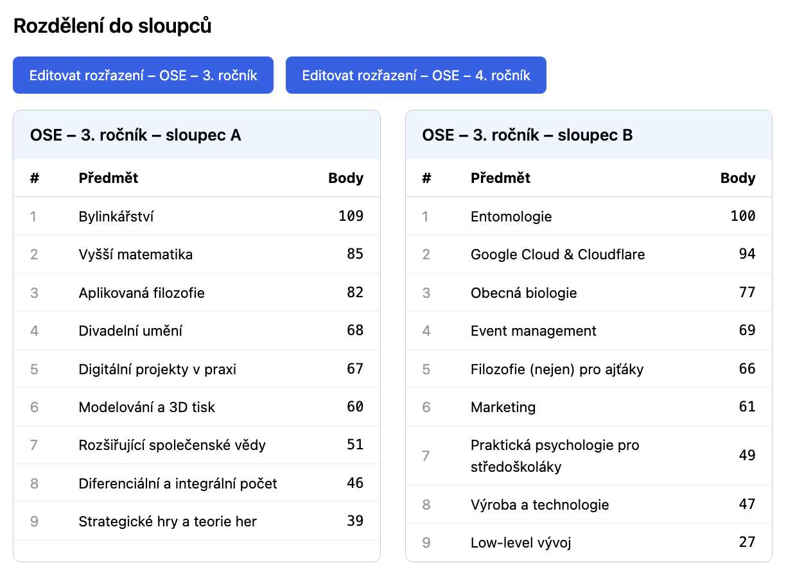

---

### 9. Admin runs enrollment

Students are automatically assigned to their highest-preferred subject per column.

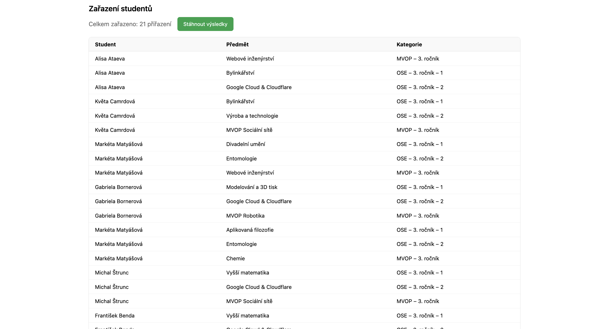

---

### 10. Admin exports to Excel

Download enrollment data as `.xlsx` — one sheet per category.

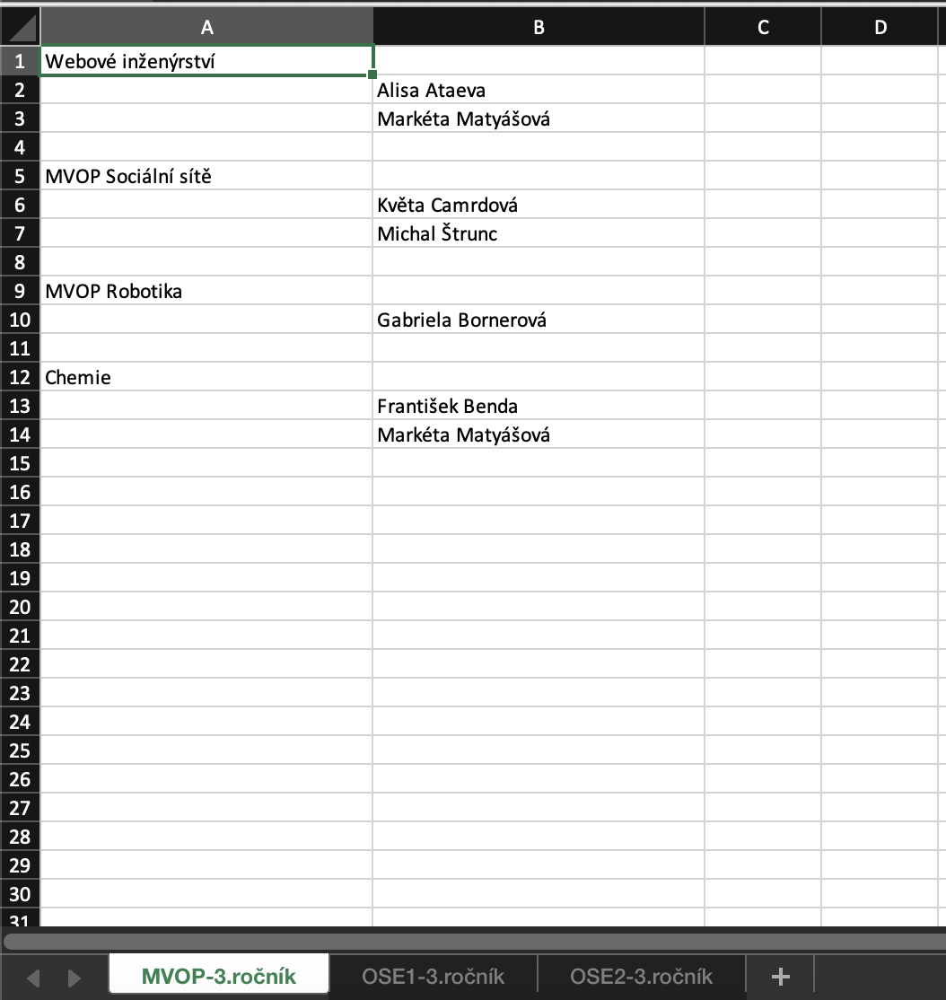

---

### Admin overview

Central dashboard with all management tools.

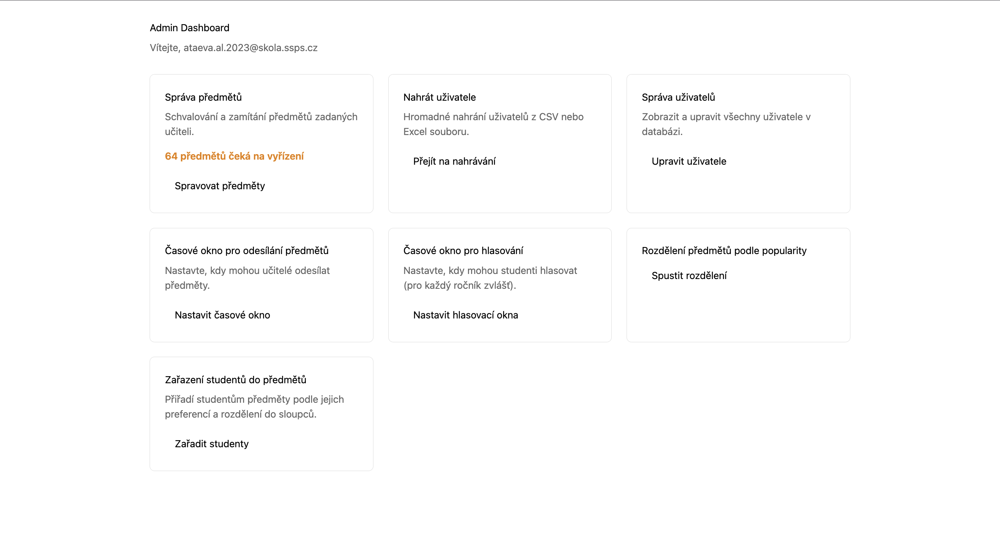

### User management

Bulk import from CSV/Excel, inline editing, role assignment.

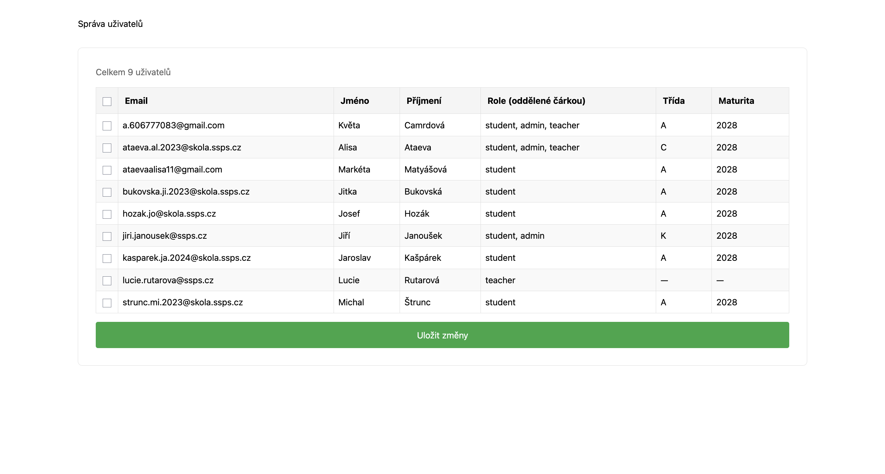
